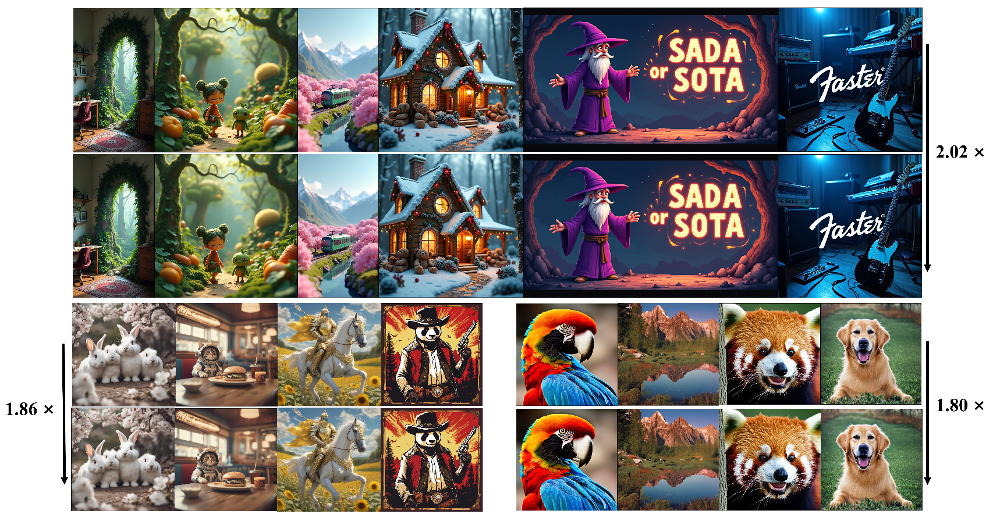
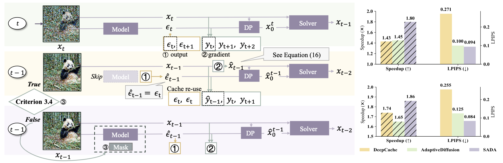

# **SADA: Stability-guided Adaptive Diffusion Acceleration**


<p align="center">
  
</p>

*Fig.&nbsp;1. Accelerating Flux, SDXL, SD-2 by 2.02×,1.86×,1.80× with Stability-guided Adaptive Diffusion Acceleration with 50 inference steps.*

## 🔨 Installation
**SADA plugs straight into any project built on HuggingFace Diffusers🤗.**  To start with a new environment, set up and running in two quick steps:

1. Create and activate a new conda environment:

```bash
git clone https://github.com/Ting-Justin-Jiang/sada-icml.git
conda create -n sada python=3.10
conda activate sada
```

2. Install the required packages:

```bash
pip install -r requirements.txt
```
---
## 🚀 Quickstart

We provide the following demos to test **SADA** with **SD-2**, **SD-XL**, and **Flux** architecture. Simply run:

```bash
python sd_demo.py 
```
```bash
python xl_demo.py 
```
```bash
python flux_demo.py 
```
---
with `--solver {dpm|euler}`， `--prompt`, and `--seed`

For any 🤗diffuser-based environment, **SADA** could be applied and enabled by a single configuration call 🔥🔥🔥:
```python
patch.apply_patch(pipe,
                    sx=3, sy=3,
                    max_downsample=1,
                    acc_range=(10, 47),

                    lagrange_int=4,
                    lagrange_step=24,
                    lagrange_term=4,

                    max_fix=1024 * 5,
                    max_interval=4
                  )
```

**Finetuning**: If you have a LoRA checkpoint, uncomment the relevant lines in the demo scripts and set lora_path to your file. You can also swap the default pretrained models for any fine‑tuned variants sharing the same backbone.

---


<p align="center">
  
</p>

*Fig.&nbsp;2. Overview of SADA pipeline.*


## 📕 Citation

If you find this work useful, please cite our paper:

```bibtex
@inproceedings{jiang2024sada,
  title     = {SADA: Stability-guided Adaptive Diffusion Acceleration},
  author    = {Ting Jiang and Yixiao Wang and Hancheng Ye and Zishan Shao and Jingwei Sun and Jingyang Zhang and Zekai Chen and Jianyi Zhang and Yiran Chen and Hai Li},
  booktitle = {Proceedings of the 42nd International Conference on Machine Learning},
  year      = {2025}
}
```

---

## 🍾 Acknowledgement
SADA codebase is build upon the excellent work of [Huggingface Diffuser](https://github.com/huggingface/diffusers) and [ToMeSD](https://github.com/dbolya/tomesd)